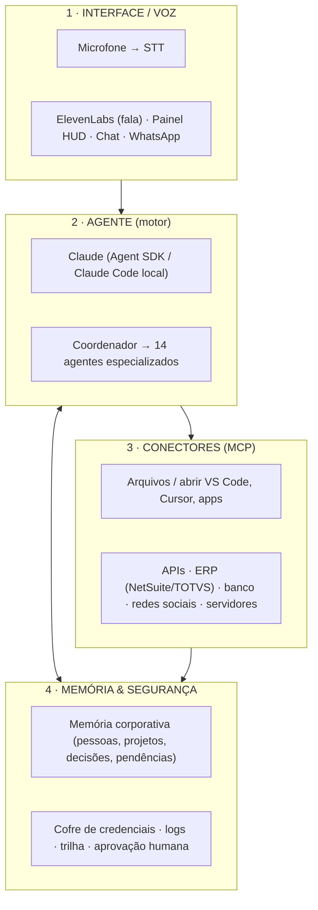

# ARQUITETURA RUNTIME DO JARVIS — "o corpo"

Projeto técnico do ambiente de execução que dá ao JARVIS as capacidades de um assistente
autônomo: **voz**, **execução local** (ler pastas, abrir apps, rodar comandos),
**conectores** (APIs, ERP, redes sociais, servidores) e **memória com ações**.

> Relação com o resto do repositório: `PROMPT-MESTRE-JARVIS.md` + `agentes/` são o **cérebro**
> (personalidade e regras, portáteis). `PROTOCOLO-AUTONOMIA.md` é o **comportamento**. Este
> documento é o **corpo** — onde e como o cérebro ganha mãos.

---

## 1. Princípio: cérebro × corpo

O cérebro roda em qualquer lugar. O corpo precisa de um **host** — um programa rodando na
**sua máquina** ou num **servidor seu**. O ambiente na nuvem (onde este repositório foi
montado) é isolado por segurança e **não alcança o seu computador**. Logo, as capacidades
"Homem de Ferro" rodam no seu hardware, não na nuvem.

---

## 2. Visão em 4 camadas

---

## 3. Camada 1 — Interface / Voz

- **Entrada de voz:** microfone → transcrição (STT). Opções: ElevenLabs (STT), Whisper local
  ou API de fala do sistema.
- **Saída de voz:** **ElevenLabs (TTS)** para o JARVIS "falar" com voz natural.
- **Outras interfaces:** o painel HUD (já prototipado), chat, e WhatsApp Business (integração oficial).
- **Fluxo:** mic → STT → **texto vai ao Agente** → resposta em texto → TTS fala + registra no painel.

> Voz é uma casca por fora do motor. O "inteligente" acontece na Camada 2; a voz só ouve e fala.

---

## 4. Camada 2 — Agente (o motor)

O núcleo é o **Claude** operando como agente com ferramentas. Dois caminhos, combináveis:

- **Claude Code na sua máquina** — já **lê pastas, roda comandos e abre apps locais**
  (VS Code, Cursor, etc.) no computador onde está instalado. É o caminho mais rápido para a
  parte "execução local".
- **Claude Agent SDK** — para construir um serviço próprio do JARVIS (rodando num servidor
  seu), com laço autônomo de ferramentas, ideal para rotinas 24/7 e ações em serviços externos.

**Orquestração:** o **Coordenador** (`agentes/00-coordenador.md`) recebe o objetivo, decide
quais dos 14 agentes acionar, executa e consolida — exatamente o loop do `PROTOCOLO-AUTONOMIA.md`.

---

## 5. Camada 3 — Conectores (MCP)

**MCP (Model Context Protocol)** é o "padrão de tomada" que liga o agente a ferramentas e
serviços. Cada capacidade que você citou vira um conector:

| Capacidade desejada | Conector / ferramenta |
|---|---|
| Ler pastas, mover/abrir arquivos | Servidor MCP de sistema de arquivos |
| Abrir VS Code / Cursor / apps | Execução de comando local (shell) no host |
| Acionar servidores | MCP/HTTP para SSH, APIs de infra, webhooks |
| Gerenciar redes sociais | APIs oficiais (Meta, LinkedIn, etc.) via conector |
| ERP e banco | NetSuite / TOTVS por API; banco por arquivo (CNAB/OFX) ou API |
| E-mail, agenda, Drive | Conectores Gmail / Google Calendar / Google Drive |

**Regra de acesso:** menor privilégio — usuário próprio por conector, permissões limitadas,
logs e revogação (conforme seção 7 do prompt mestre).

---

## 6. Camada 4 — Memória & Segurança

- **Memória corporativa persistente:** guarda pessoas, empresas, projetos, decisões e
  pendências (estrutura da seção 8 do prompt mestre). Implementação: arquivos versionados +
  banco/índice de busca para recuperar contexto entre conversas.
- **Cofre de credenciais:** senhas, tokens e certificados **fora do texto** — em cofre
  (ex.: gerenciador de segredos) ou variáveis de ambiente. O JARVIS nunca lê credencial em conversa.
- **Trilha e logs:** todo acesso e ação registrados para auditoria.
- **Aprovação humana:** ações de alto impacto passam por confirmação sua.

---

## 7. Fronteira de autonomia (a trava de ouro)

| JARVIS faz sozinho | Só com seu "ok" |
|---|---|
| Ouvir, entender, decidir quais agentes usar | Pagar, transferir, mexer em dinheiro |
| Ler dados, cruzar, analisar, **recomendar** | Liberar crédito, bloquear, negativar |
| Abrir apps/pastas e organizar arquivos (uso interno) | Publicar em rede social / enviar oficial |
| Montar relatórios, planos, lembretes, cobranças internas | Assinar contrato, alterar cadastro fiscal/bancário |
| Rodar as rotinas diárias/semanais/mensais | Alterar preços, comissões, admitir/desligar |

**Autonomia total para pensar e recomendar; execução de alto impacto sempre com aprovação.**

---

## 8. Onde cada coisa roda

| Componente | Onde roda | Alcança seu PC? |
|---|---|---|
| Cérebro (prompt + agentes) | Portátil | — |
| Claude Code local | **Sua máquina** | **Sim** (é o objetivo) |
| Serviço JARVIS (Agent SDK) | **Servidor seu** | Só via conectores autorizados |
| Este ambiente (nuvem) | Sandbox isolado | **Não** |
| Voz (STT/TTS) | App no celular/PC | — |

---

## 9. Roteiro de implantação (do corpo)

1. **Base local** — instalar o Claude Code na sua máquina, apontar para o repositório do
   JARVIS. Já habilita ler pastas, rodar comandos e abrir apps localmente.
2. **Conectores essenciais** — Google (agenda, e-mail, Drive) + sistema de arquivos.
3. **Memória** — definir onde a memória corporativa é gravada e como é consultada.
4. **Segurança** — cofre de credenciais, logs e as travas de aprovação.
5. **Voz** — plugar STT + ElevenLabs (TTS) na interface.
6. **Serviço 24/7** — subir o JARVIS como serviço (Agent SDK) num servidor para as rotinas
   autônomas (relatório diário, alertas).
7. **Conectores avançados** — ERP (NetSuite/TOTVS), banco, redes sociais, servidores — um a
   um, com aprovação e teste.

> Ordem alinhada ao prompt mestre: primeiro base confiável e dados, depois automação e ações.

---

## 10. Stack sugerida (ponto de partida, a validar com a TI)

- **Agente:** Claude Code (local) + Claude Agent SDK (serviço).
- **Conectores:** servidores MCP (arquivos, Google, HTTP/APIs).
- **Voz:** ElevenLabs (TTS) + STT (ElevenLabs/Whisper).
- **Memória:** arquivos versionados + banco/índice de busca.
- **Segurança:** cofre de segredos, logs centralizados, autenticação por conector.

---

## 11. Riscos e cuidados

- **Acesso ao computador é poderoso** — limite pastas e comandos permitidos; comece restrito.
- **Ações externas são irreversíveis** — mantenha a trava de aprovação e um "modo simulação"
  antes de agir de verdade.
- **Credenciais** — nunca em texto, nunca no repositório; sempre em cofre.
- **Separar teste de produção** — validar tudo em ambiente de teste antes de ligar em produção.
- **Não migrar erros/automatizar processo ruim** — arrumar o processo antes de automatizá-lo.
